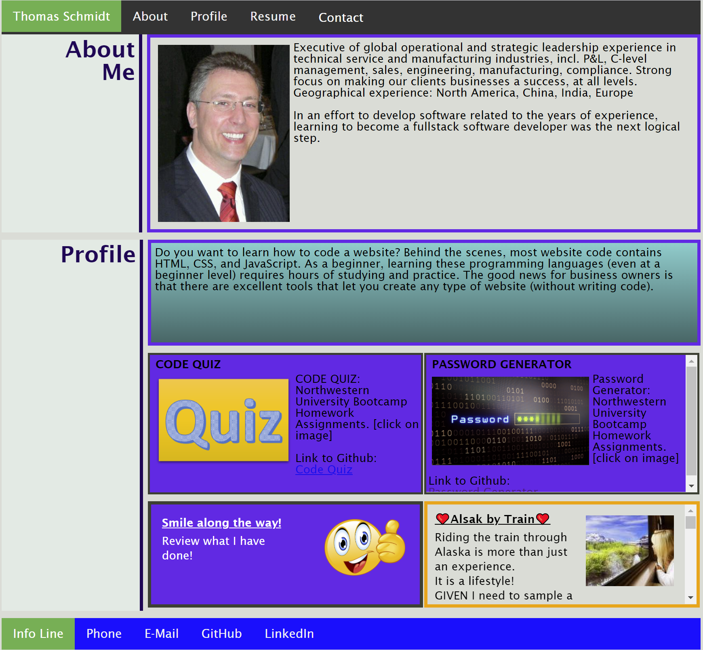
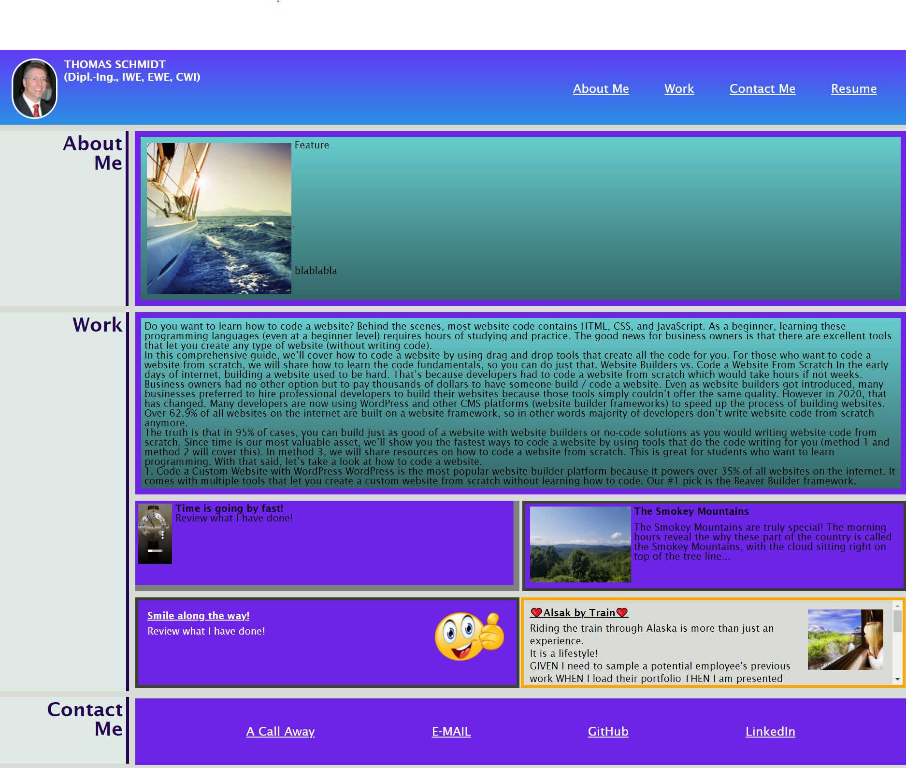

# 08_Professional_Materials
Updated Profile

## Wireframe
```
In this update, the wireframe did not change ntegrated. 
```

## Updates
 - Included new responsive header and footer
 - included "Contact" Modal
 - linked work from Github (Pasword Generator; Quiz) 



https://thomas-nw.github.io/08_Professional_Materials/


## Important Notation
- Updates are still required for design and layout. 
- Time constraints did not allow to complete the work

## Previous Work Assignment
``` 
WHEN I load their portfolio
THEN I am presented with the developer's name, a recent photo, and links to sections about them, their work, and how to contact them

WHEN I click one of the links in the navigation
THEN the UI scrolls to the corresponding section

WHEN I click on the link to the section about their work
THEN the UI scrolls to a section with titled images of the developer's applications

WHEN I am presented with the developer's first application
THEN that application's image should be larger in size than the others

WHEN I click on the images of the applications
THEN I am taken to that deployed application

WHEN I resize the page or view the site on various screens and devices
THEN I am presented with a responsive layout that adapts to my viewport
```  

## Oroginal Profile Page



https://thomas-nw.github.io/Profile_TS/
- - -
